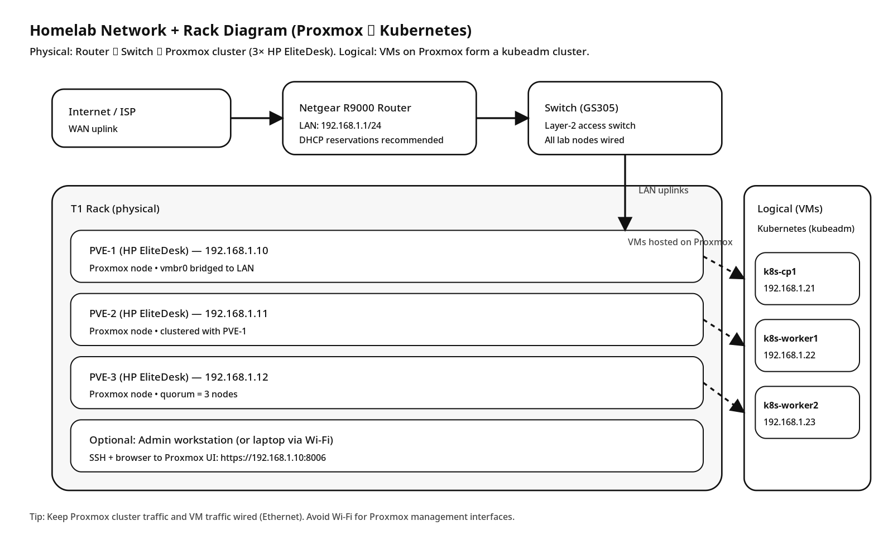

# 🖥️ Kubernetes Homelab (Proxmox + kubeadm)

This repository contains a complete, repeatable setup for building a Kubernetes lab on Proxmox using Ubuntu 22.04, containerd, and kubeadm.

---

# 🗺️ Lab Diagram



> Physical: Router → Switch → Proxmox cluster (3× HP EliteDesk)  
> Logical: Kubernetes VMs (kubeadm) running on Proxmox

---

# 📁 Repository Structure

| File | Purpose |
|------|---------|
| [`proxmox_setup.md`](proxmox_setup.md) | Proxmox installation, networking, cloud-init template creation, and VM cloning |
| [`runbook.md`](runbook.md) | Step-by-step Kubernetes cluster build (manual workflow) |
| [`k8s_prereqs_playbook.md`](k8s_prereqs_playbook.md) | Ansible automation for node preparation (containerd + kube packages) |
| `docs/diagrams/network_rack_diagram.svg` | Editable vector diagram |
| `docs/diagrams/network_rack_diagram.png` | PNG diagram (embedded above) |

---

# 🧭 Recommended Workflow

## 1️⃣ Build Proxmox Foundation

Start here:

👉 **`proxmox_setup.md`**

This covers:

- Installing Proxmox VE
- Network bridge (`vmbr0`) setup
- Storage layout
- Creating Ubuntu cloud-init template
- Cloning Kubernetes VMs

When complete, you should have:

- `k8s-cp1`
- `k8s-worker1`
- `k8s-worker2`

All reachable via SSH.

---

## 2️⃣ Prepare Nodes (Two Options)

### Option A — Manual

Follow:

👉 **`runbook.md`**

This walks through:

- Disable swap
- Configure kernel modules + sysctl
- Install containerd
- Install kubeadm/kubelet/kubectl

---

### Option B — Automated (Recommended for repeatability)

Use:

👉 **`k8s_prereqs_playbook.md`**

From your workstation:

```bash
ansible-playbook -i ansible/inventory.ini ansible/k8s_prereqs.yml
```

This prepares all nodes consistently.

---

## 3️⃣ Initialize Kubernetes

After prerequisites are complete:

On `k8s-cp1`:

```bash
sudo kubeadm init --pod-network-cidr=10.244.0.0/16
```

Configure kubectl, install Flannel, then join workers (see `runbook.md`).

---

# ✅ Validation Checklist

After full setup:

```bash
kubectl get nodes
```

Expected:

- k8s-cp1 Ready
- k8s-worker1 Ready
- k8s-worker2 Ready

Test workload:

```bash
kubectl run hello --image=nginx --restart=Never
kubectl get pods -o wide
```

---

# 🔁 Rebuild Strategy

If something breaks:

1. Delete VMs in Proxmox
2. Re-clone from template
3. Re-run Ansible playbook
4. Re-run kubeadm init + join

This keeps the lab reproducible and clean.

---

# 🚀 Future Enhancements

- Add metrics-server
- Install ingress controller
- Deploy ArgoCD
- Add Longhorn for storage
- Convert to HA control plane
- Add CI/CD pipeline testing

---

# 🏁 Summary

This repo provides:

- Infrastructure layer (Proxmox)
- Node preparation automation (Ansible)
- Kubernetes build runbook
- Repeatable homelab architecture

You now have a professional-grade lab foundation for:

- Kubernetes experimentation
- GitOps workflows
- DevOps automation
- Cloud-native learning

---

Built for homelab experimentation and learning.
